# Protein Final Project

This project is the Patika- Protein Devops bootcamp graduation project. There is a simple React application in the project. This React application is built and tested in the CI/CD pipeline. It is then dockerized in the pipeline with the created Dockerfile. The created Docker image is deployed to the AWS ECS service with Pipeline. AWS ECS service is built declaratively with Terraform. The application is also deployed to the K8S environment.

## Terraform & AWS 

Elastic Container Service (ECS) is built on the AWS platform. ECS service and VPC required for ECS service are created with Security Group and Load balancer Terraform. Terraform files are located in the ./terraform folder. The architecture of the AWS ECS Fargate service and other services created with Terraform is shown in the image below.

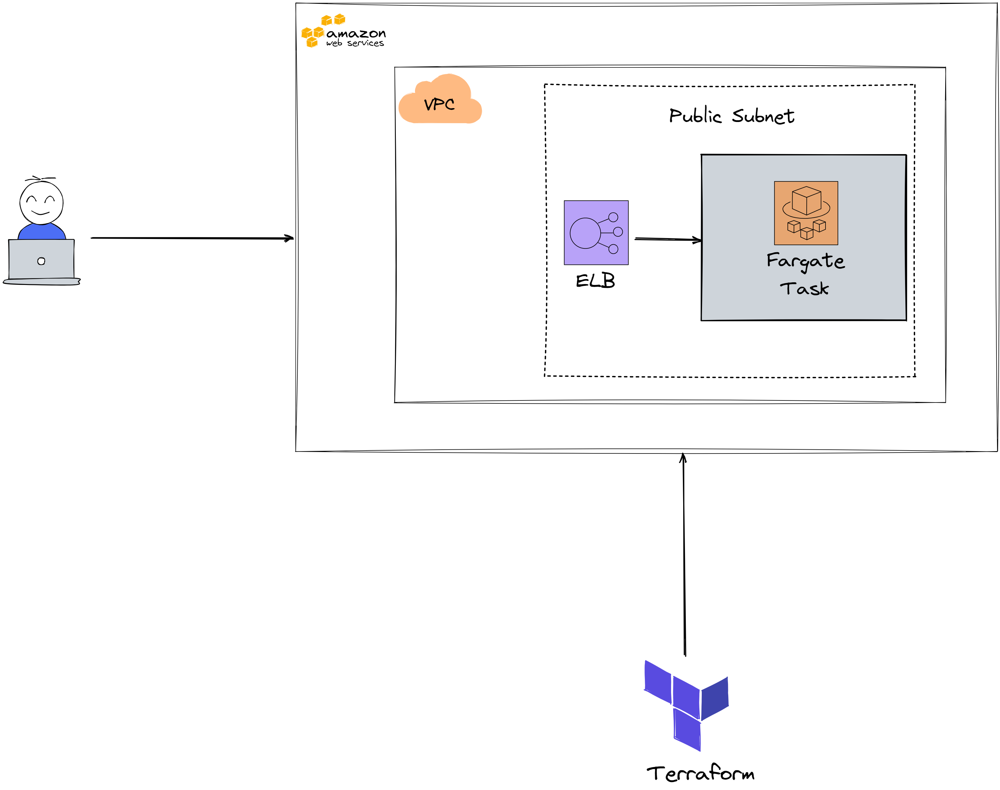

 **NOTE:** AWS architecture is drawn with excalidraw implementation instead of draw.io. Excalidraw file has been added to the repo with the name Aws-Architecture.excalidraw. It is the output of the above architecture in png format.

In order to install the architectural services in the image with Terraform, the following operations should be performed in the directory where the Terraform files are located:

### `terraform init`

With this command, terraform is initialized in that directory and necessary downloads are made.

### `terraform plan`

With this command, the configuration written in Terraform is reviewed.

### `terraform apply`

The configuration written with this command is performed on AWS. AWS VPC, AWS ECS, AWS ELB services are created when the command is executed. The following screenshots show the services created with Terraform.

AWS ECS Cluster

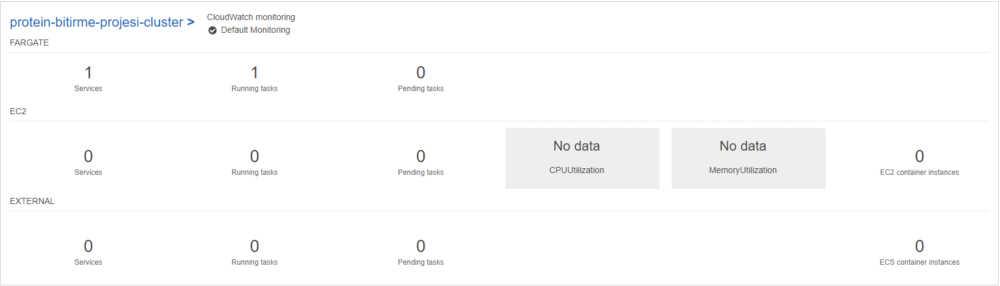

AWS VPC & Security Group

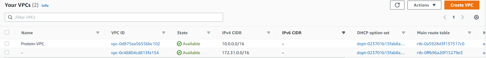

AWS ELB

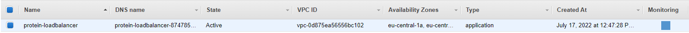

AWS CloudWatch

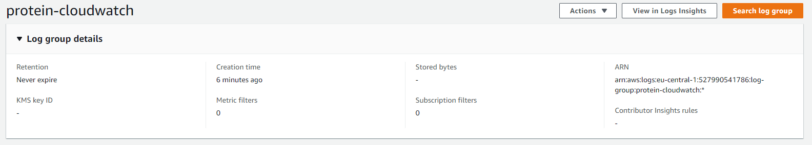

## Gitlab Runner & CI/CD Pipeline

The CI/CD pipeline is not running as a shared runner, but Gitlab Runner on the local computer. Gitlab Runner is installed on local computer with Docker. Command entered to configure Gitlab Runner:

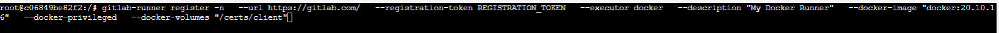

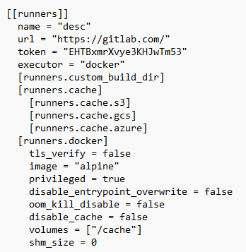

In the CI/CD pipeline, the project goes through the build and test phases. The React project is built with the npm tool and then tested. In Pipeline, after build and test, there is a step to build the Docker image and push it to Dockerhub. In this step, the Docker image gets different tags in each pipeline. It is deployed with these tags in the environments where it is deployed. The built Docker image is deployed to both AWS ECS Fargate service and Kubernetes Cluster. Deployed images are shown in Terraform and Kubernetes sections.

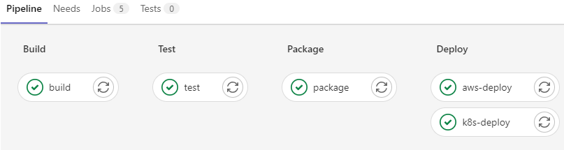

The React app runs on AWS ECS cluster after deploy stage. 

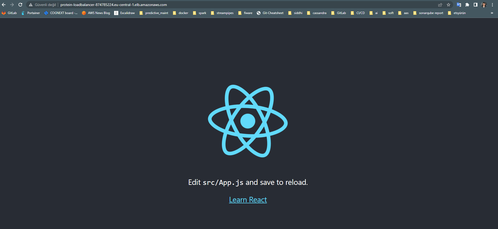

## Kubernetes

In order to deploy the project to Kubernetes, an agent was created in Gitlab and this agent was installed in the K8S cluster with Helm.

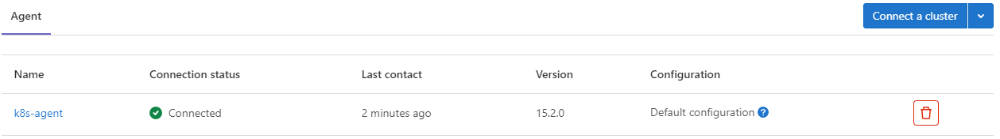

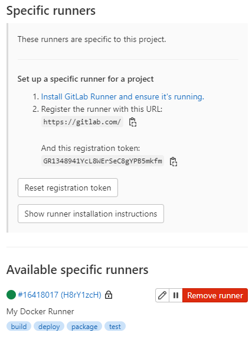

Deployment object was created with the built Docker image. The deployment.yaml file is located in the Kubernetes directory. The deployment object and service object created in the CI/CD pipeline are shown below. A Nodeport type service has been created so that the created deployment object can be accessed from outside.

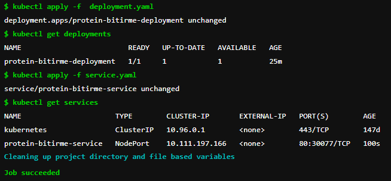

